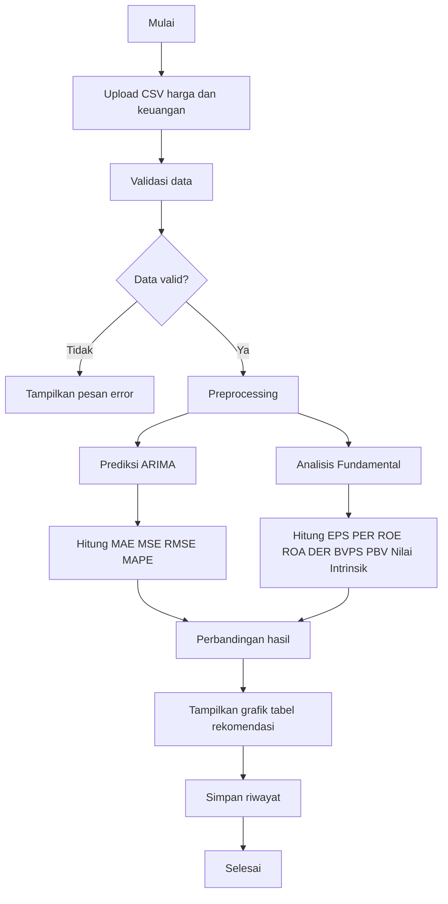

# Flowchart Sistem

```mermaid
flowchart TD
A[Mulai] --> B[Upload CSV harga dan keuangan]
B --> C[Validasi data]
C --> D{Data valid?}
D -- Tidak --> E[Tampilkan pesan error]
D -- Ya --> F[Preprocessing]
F --> G[Prediksi ARIMA]
F --> H[Analisis Fundamental]
G --> I[Hitung MAE MSE RMSE MAPE]
H --> J[Hitung EPS PER ROE ROA DER BVPS PBV Nilai Intrinsik]
I --> K[Perbandingan hasil]
J --> K
K --> L[Tampilkan grafik tabel rekomendasi]
L --> M[Simpan riwayat]
M --> N[Selesai]
```
